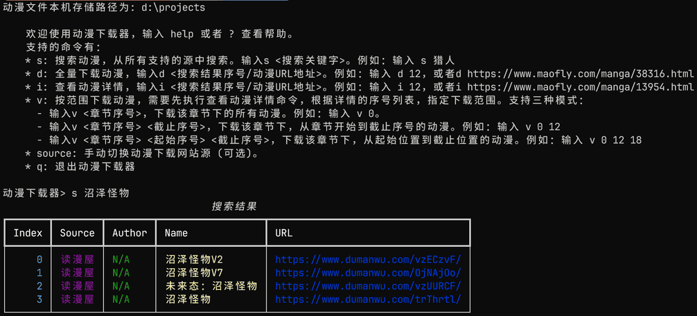
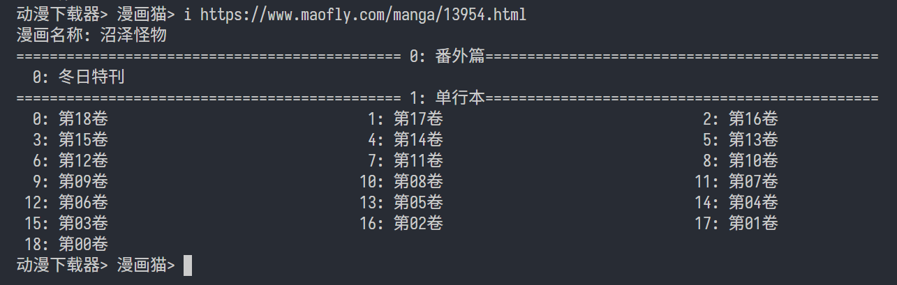

# 动漫下载器

轻量级动漫下载器，CLI方式单线程下载。目前支持的网站有：
- 漫画猫
- 动漫之家



## 安装

### 安装依赖

下载 [Firefox Gecko 驱动](https://github.com/mozilla/geckodriver/releases)，解压后放到可执行Path中。

### 源代码编译
1. 安装依赖（可选，用源码启动方式必须执行）。
   
   ```shell
   pip install -r requirements.txt
   ```
2. 打包二进制文件（可选）。

   ```shell
   pyinstaller downloader.spec
   ```

### 二进制文件

如不想编译，可访问 [Releases 页面](https://github.com/fjcanyue/comic_downloader/releases/latest)，直接下载 *comic_downloader.exe* 可执行文件。

## 运行

### 从源代码启动

```shell
python main.py <下载路径>
```

### 从二进制文件启动

```shell
comic_downloader <下载路径>
```

## 使用说明

1. 先输入动漫下载网站源，目前支持的网站有：
   * **maofly**: 漫画猫
   * **dmzj**: 动漫之家

2. 输入动漫下载网站源后，支持的命令有：
   * **s**: 搜索动漫，输入```s <搜索关键字>```。例如：输入```s 猎人```，搜索包含猎人的动漫
   * **d**: 全量下载动漫，输入```d <搜索结果序号/动漫URL地址>```。例如：输入```d 12```，全量下载搜索结果序号为12的动漫
   * **i**: 查看动漫详情，输入```i <搜索结果序号/动漫URL地址>```。例如：输入```i https://www.maofly.com/manga/13954.html```，显示该URL的动漫详情
     
   * **v**: 按范围下载动漫，需要先执行查看动漫详情命令，根据详情的序号列表，指定下载范围。支持三种模式：
     - 输入```v <章节序号>```，下载该章节下的所有动漫。例如：输入```v 1```，下载上图所示单行本章节下所有漫画
     - 输入```v <章节序号> <截止序号>```，下载该章节下，从章节开始到截止序号的动漫。例如：输入```v 1 12```，下载上图所示单行本章节下，从开始0: 第18卷到12: 第06卷的漫画
     - 输入```v <章节序号> <起始序号> <截止序号>```，下载该章节下，从起始位置到截止位置的动漫。例如：输入```v 1 12``` 18，下载上图所示单行本章节下，从开始12: 第06卷的漫画到18: 第00卷的漫画

3. 按 **q** 键退出动漫下载器。