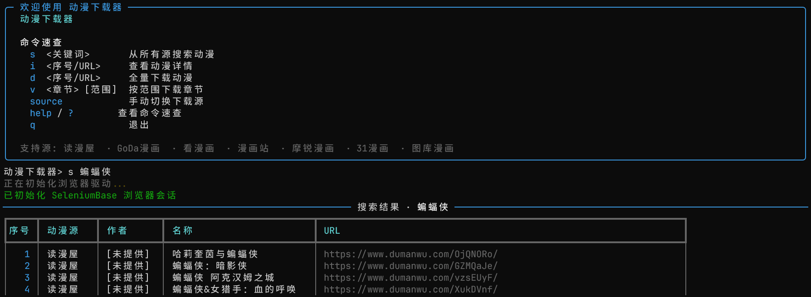
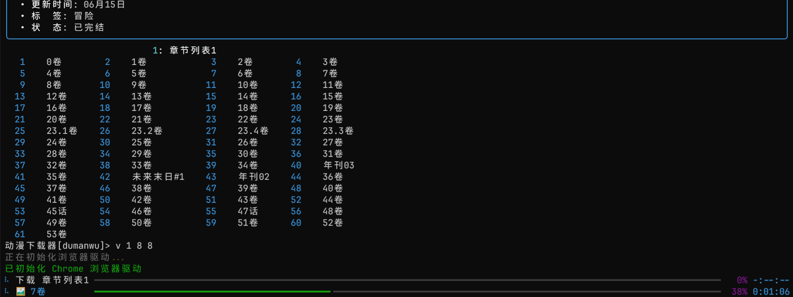

# 动漫下载器

轻量级动漫下载器，CLI 方式单线程下载。支持三种浏览器渲染模式，自动在请求被屏蔽时回退。

## 支持的网站

| 网站 | 状态 | 浏览器模式 |
|------|------|------------|
| [摩锐漫画](https://www.morui.com) | ✅ 可用 | SeleniumBase / CloakBrowser  |
| [读漫屋](https://www.dumanwu.com) | ✅ 可用 | requests |
| [漫蛙](https://www.manhuagui.com) | ✅ 可用 （境外） | requests |
| [漫画站](https://www.manhuazhan.com) | ✅ 可用 | requests |
| [31漫画](https://www.thmh.com) | ✅ 可用 | requests |

[](https://asciinema.org/a/H7hsCmPz1v9mqpxF4t40oLomM)

## 浏览器模式

工具支持三种 HTML 解析方式，按源的配置自动切换：

| 模式 | 说明 | 是否需要浏览器驱动 |
|------|------|-------------------|
| **requests** | 使用 HTTP 请求直接获取 HTML | 否 |
| **SeleniumBase** | 使用 SeleniumBase CDP 模式渲染页面 | 是 |
| **CloakBrowser** | 使用 CloakBrowser 反爬浏览器，可能需要人工介入 | 是 |

> **自动回退**: 当 requests 模式收到 HTTP 403/429 时，会自动切换到 SeleniumBase 模式重试。

## 快速开始

### 运行二进制文件

从 [Releases 页面](https://github.com/fjcanyue/comic_downloader/releases/latest) 下载 `comic_downloader.exe`：

```shell
comic_downloader <下载路径>
```

不传路径时默认保存到当前目录。

### 从源码运行

```shell
uv sync
uv run main.py <下载路径>
```

### 打包

```shell
uv run pyinstaller downloader.spec
```

## 使用说明

### 交互式命令

启动后进入交互式 shell，支持以下命令：

| 命令 | 说明 | 示例 |
|------|------|------|
| `s <关键词>` | 从所有启用的源中搜索动漫 | `s 猎人` |
| `i <序号/URL>` | 查看动漫详情（章节列表） | `i 1` 或 `i https://...` |
| `d <序号/URL>` | 全量下载动漫 | `d 12` 或 `d https://...` |
| `v <参数>` | 按范围下载章节 | `v 1` `v 1 12` `v 1 5 10` |
| `source` | 手动选择动漫源（可选） | `source` |
| `q` | 退出 | `q` |

 
 
 

### `v` 命令三种模式

1. `v <章节序号>` — 下载该章节下的所有话
2. `v <章节序号> <截止序号>` — 从章节开始到截止序号
3. `v <章节序号> <起始序号> <截止序号>` — 指定起始到截止范围

### 直接子命令

不进入交互式 shell，直接执行：

```shell
comic_downloader search <关键词>
comic_downloader info <URL>
comic_downloader download <URL>
comic_downloader download_vols <URL> <章节序号> [起始] [截止]
```

### 选项

| 选项 | 说明 |
|------|------|
| `-d`, `--debug` | 输出调试日志到终端 |
| `--overwrite` | 覆盖已存在的下载文件 |
| `-h`, `--help` | 显示帮助 |

## 要求

- Python >= 3.10
- 下载需要浏览器驱动时：Firefox + Gecko Driver / Chrome

搜索和查看详情等不依赖浏览器的命令可直接运行，无需预先安装浏览器驱动。
