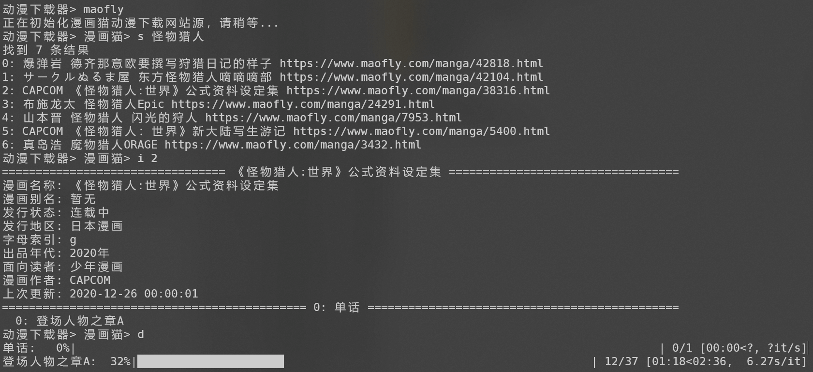

# 动漫下载器

轻量级动漫下载器，CLI方式单线程下载。目前支持的网站有：
- 漫画猫



## 安装

### 安装依赖

下载 [Firefox Gecko 驱动](https://github.com/mozilla/geckodriver/releases)，解压后放到可执行Path中。

### 源代码编译
1. 安装依赖（可选，用源码启动方式必须执行）。
   
   ```shell
   pip install -r requirements.txt
   ```
2. 打包二进制文件（可选）。

   ```shell
   pyinstaller downloader.spec
   ```

### 二进制文件

如不想编译，可访问 [Releases 页面](https://github.com/fjcanyue/comic_downloader/releases/latest)，直接下载 *comic_downloader.exe* 可执行文件。

## 运行

### 从源代码启动

```shell
python main.py <下载路径>
```

### 从二进制文件启动

```shell
comic_downloader <下载路径>
```

## 使用说明

1. 先输入动漫下载网站源，目前支持的网站有：
   * **maofly**: 漫画猫

2. 输入动漫下载网站源后，支持的命令有：
   * **s**: 搜索动漫，输入s <搜索关键字>，例如：s 猎人
   * **d**: 下载动漫，输入s <搜索结果序号/动漫URL地址>，例如：d 12

3. 按 **q** 键退出动漫下载器。